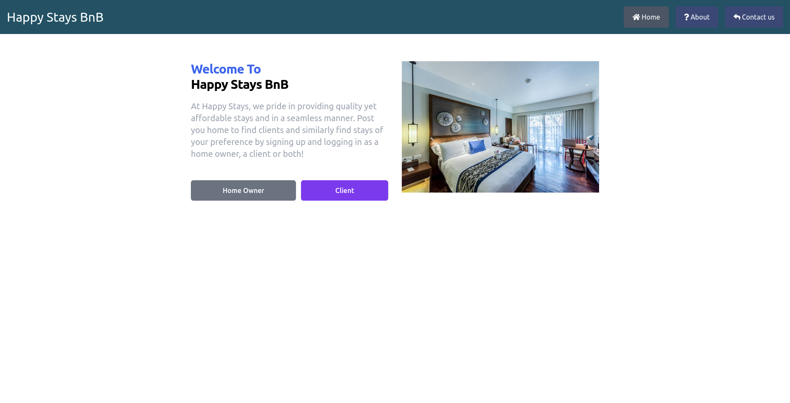

README.md

Happy Stays Bnb

Created By Jeff Ndungu Wanjiku on 30-03-2023

Description
Happy Stays Bnb is a a website that provides a way for a owner to create, update houses which the owner will make them for a client to book a bnb. It also provides a way for a client to book a bnb, updates his/her account details and also view the bnb booked and also the available bnbs.

<!--Frontend Deployment link  -->
https://phase-iv-frontend.vercel.app/

<!-- Backend Deployment link  -->
https://jeff-bnb.onrender.com

<!-- GITHUB LINK FOR THE BACKEND -->
https://github.com/ndungu-jeff/jeff-bnb

<!-- Setup Requirements -->
• Git
• Web-browser or your choice
• Github
• NPM (https://www.npmjs.com/)

<!-- Development server -->
Run npx vite for a dev server. Navigate to http://localhost:5173/. The app will automatically reload if you change any of the source files.

<!-- Technologies Used -->
The following have been used on this project:
• React
• Tailwind
• Vite
• Figma
Live link to view the project View Happy Stays Bnb APP
<!-- Screenshots Of the Figma Design -->
• Homepage
   
   screenshot
• Bookview
   
   screenshot
• Client View Available Houses
   
   screenshot
• CreteAccount
   
   screenshot
• Homepage
   
   screenshot
• Login
   
    screenshot
• Myhouses

 screenshot
• posthouse
   
To make a contribution to the code used or any suggestions you can click on the contact link and email me your suggestions.
• Email: ndungujeff.ke@gmail.com
<!-- License -->
Copyright (c) 2022 Jeff Ndungu Wanjiku.
Permission is hereby granted, free of charge, to any person obtaining a copy  
of this software and associated documentation files , to deal  
in the Software without restriction, including without limitation the rights  
to use, copy, modify, merge, publish, distribute, sublicense, and/or sell  
copies of the Software, and to permit persons to whom the Software is  
furnished to do so, subject to the following conditions:
The above copyright notice and this permission notice shall be included in all  
copies or substantial portions of the Software.
THE SOFTWARE IS PROVIDED "AS IS", WITHOUT WARRANTY OF ANY KIND, EXPRESS OR  
IMPLIED, INCLUDING BUT NOT LIMITED TO THE WARRANTIES OF MERCHANTABILITY,  
FITNESS FOR A PARTICULAR PURPOSE AND NONINFRINGEMENT. IN NO EVENT SHALL THE  
AUTHORS OR COPYRIGHT HOLDERS BE LIABLE FOR ANY CLAIM, DAMAGES OR OTHER  
LIABILITY, WHETHER IN AN ACTION OF CONTRACT, TORT OR OTHERWISE, ARISING FROM,  
OUT OF OR IN CONNECTION WITH THE SOFTWARE OR THE USE OR OTHER DEALINGS IN THE  
SOFTWARE.